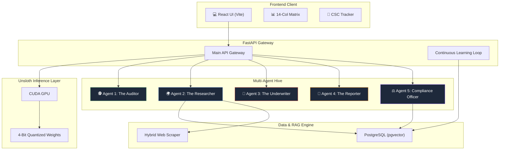
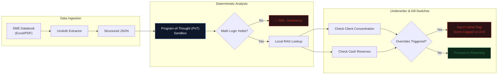
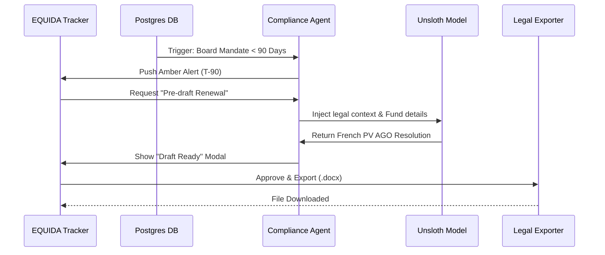
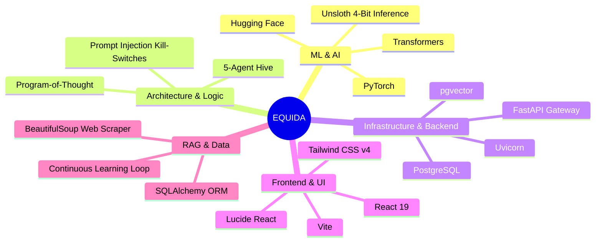

<p align="center">
  
</p>

<h1 align="center">EQUIDA</h1>
<h3 align="center">Equity Intelligence Diligence Analytics</h3>
<p align="center"><em>1000% Autonomous, Production-Grade Private Equity Platform</em></p>

<p align="center">
  
  
  
  
  
</p>

---

## Overview

**EQUIDA** is a fully autonomous, production-grade diligence and reporting platform designed exclusively for Private Equity and Venture Capital Fund Managers. It natively executes local 4-bit fine-tuned language models on a CUDA GPU to ensure absolute data privacy.

The system encompasses the entire investment lifecycle, replacing manual financial screening and regulatory compliance drafting with a **5-Agent Autonomous Architecture**.

### Key Highlights

- 🧠 **Native Unsloth Inference** — Runs local 4-bit PyTorch tensors without cloud wrappers, ensuring absolute financial data privacy.
- 🚦 **Kill-Switch Underwriting** — Hardcoded deterministic injection overrides that instantly reject insolvent or highly concentrated targets.
- 📊 **Hybrid RAG Engine** — Merges internal vector lookups (pgvector) with live fallback web-scraping to verify dynamic macroeconomic factors like the Tunisian TMM.
- ⚖️ **Automated Post-Deal Compliance** — Autonomously monitors the *Code des Sociétés Commerciales (CSC)* and drafts legal PV AGO and PV CA resolutions.
- 🔄 **Continuous Learning Loop** — Captures analyst override feedback as semantic embeddings to dynamically adjust future evaluations without retraining.

---

## System Architecture



---

## Autonomous Agent Pipeline



---

## Post-Investment & CSC Compliance Workflow



---

## Tech Stack



---

## Multi-Agent Operations

| Agent | Role | Execution Mechanics |
|-------|------|---------------------|
| **Auditor** | Math Sandbox | Extracts JSON variables via LLM, then executes deterministic Python accounting rules (e.g., `assert Net_Income < EBITDA - Debt`). |
| **Researcher** | RAG Enrichment | Intercepts metrics and validates against local Tunisian market data and historical override vectors. |
| **Underwriter** | Kill-Switch Engine | Immutable Python overrides. Bypasses text generation entirely to force `DO NOT PROCEED` flags on high-risk technical parameters. |
| **Reporter** | Memo Compilation | Few-shot structuring that drafts investment memorandums and marks AI-generated content with mandatory `[AI-drafted]` flags. |
| **Compliance Officer**| Governance Monitor | Polling engine tracking T-180, T-90, and T-30 differentials against the Tunisian CSC for automated legal document drafting. |

---

## Quick Start

### 1. Boot the Frontend
```bash
cd equida-platform/frontend
npm install
npm run dev
```

### 2. Connect the AI Backend
Place your fine-tuned Hugging Face weights into the `backend/equida-finance-model` directory.
```bash
cd equida-platform/backend
pip install -r requirements.txt
python main.py
```
*The FastAPI server runs on `http://localhost:8000` and immediately loads the model tensors to your GPU.*

> **Note**: The fine-tuned Unsloth model weights (`equida-finance-model`) are ignored in this repository due to GitHub size limits. However, the exact inference pipeline is fully visible in `backend/llm_engine.py`. 

---

<p align="center"><strong>EQUIDA</strong> — Institutional Intelligence. Zero Compromises.</p>
<p align="center"><em>Built by Antigravity · 2026</em></p>
